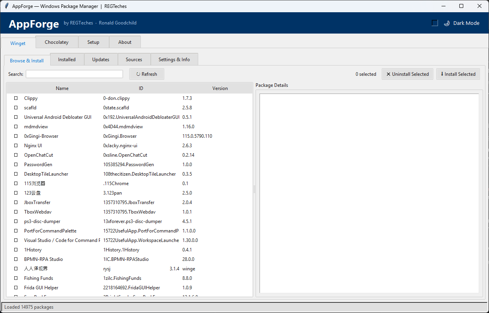

# AppForge

A free, dark-mode Windows GUI for **winget** and **Chocolatey**. Browse, install, update and uninstall apps from one window - no command line, no extra dependencies.

> Built by a working IT technician to set up new PCs fast. Free to use, free to change.

## Screenshots


*Winget tab: browse, search and install from one window*

## Features

- **Two package managers, one app** - switch between **Winget** and **Chocolatey** tabs
- **Browse & Install** - search the repositories and install with a click
- **Installed** - see what is on the machine and uninstall
- **Updates** - list outdated packages and upgrade one or all
- **Sources** - view and manage package sources
- **Setup tab** - checks whether winget / Chocolatey are installed and helps install them
- **Theme engine** and a progress dialog for long-running installs
- **Keyboard shortcuts** - Ctrl+F focuses and selects the search text in Browse or Installed; F5 refreshes the active Browse, Installed, Updates or Sources tab. Shortcuts apply to the selected package manager; Settings, Setup and About are unchanged.
- Pure Python + Tkinter - **standard library only**

## Requirements

- Windows 10 / 11
- Python 3.9+ (only to run from source)
- [winget](https://learn.microsoft.com/windows/package-manager/) (ships with Windows 11; "App Installer" on Windows 10) and/or [Chocolatey](https://chocolatey.org/install)
- Run as Administrator for installs that need elevation

## Quick start

```powershell
git clone https://github.com/ronaldgoodchild/appforge.git
cd appforge
python appforge.py
```

Want a single `.exe`? `pip install pyinstaller` then `pyinstaller --onefile --noconsole --name AppForge appforge.py`.

## Contributing

Ideas and pull requests welcome - see [CONTRIBUTING.md](CONTRIBUTING.md) and [ROADMAP.md](ROADMAP.md).

## License

[MIT](LICENSE) (c) 2026 Ronald Goodchild / REGTeches
